# TWINT Shopware Plugin Guide

## Installation
### Requirement 
1. PHP 8.1 for both web service (Apache) and CLI 
2. Minimum Requirement for Shop-system versions: 
 -  Shopware versions: 6.5 

### 1. Install the extension

Install the plugin via composer by running the following command:

```bash
composer require twint-ag/twint-shopware-plugin
```

- Alternatively, for manual installation, download the latest plugin ZIP file from our [Git repository here.](https://github.com/Twint-AG/twint-shopware-plugin/tags)

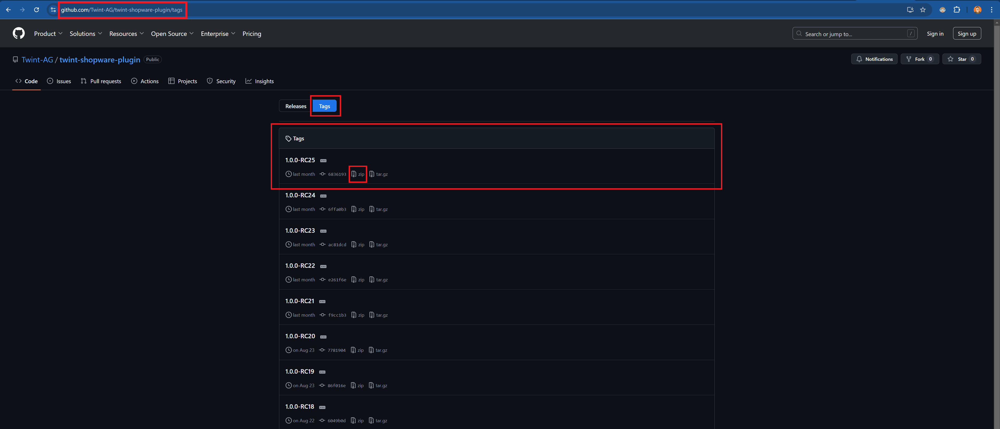

- Go to `Extensions -> My extensions`.
- Click the `Upload extension`.

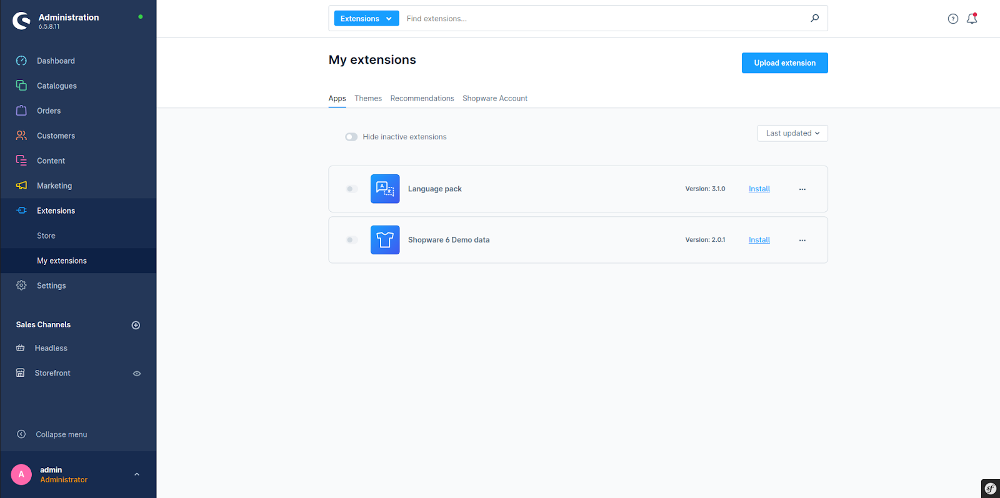

- If the warning popup displayed, click `Confirm` to acknowledge.

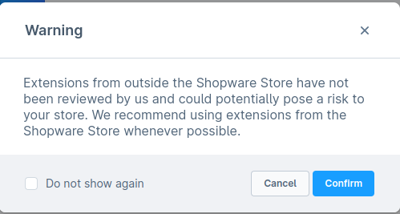

### 2 Install the extension

After the `TWINT` plugin was uploaded -> Click the `Install` link to install the extension

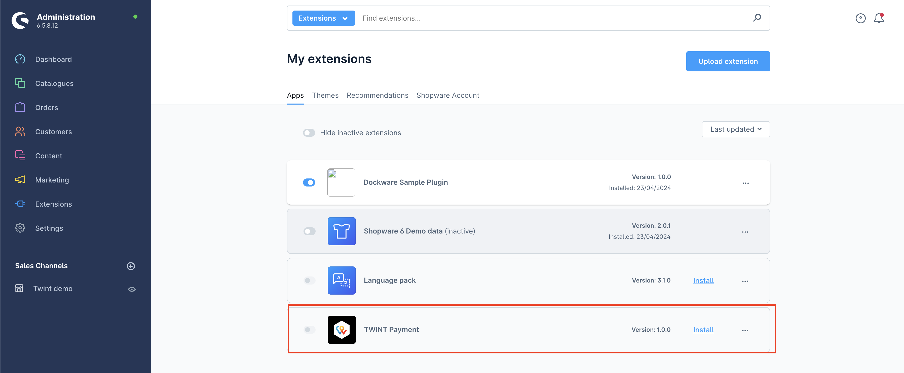

## Enable the extension

#### 1. Login to the Admin console panel

#### 2. Go to `Extensions -> My extensions`

Under the `Apps` tab -> Ensure that `TWINT` is enabled

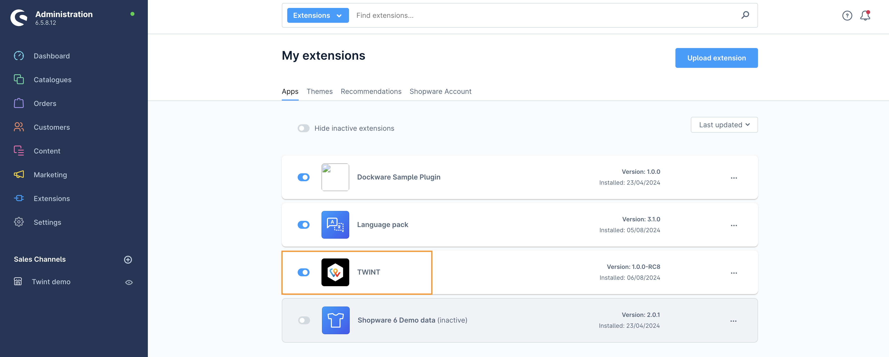

## Configure the extension

### Enter the Credential

#### 1. Login to the Admin console panel

#### 2. Go to `Settings -> Extensions -> TWINT credentials`

- Enter the `Store UUID`.
- Under the `Certificate file` click `Choose file` and browse to the `*.p12` certificate file.
- Enter the `Certificate password`.

> 🚩 **Note:**
> 
> After entering the certification password, please wait for the flash message saying `Certificate validation successful` before clicking `Save`. 

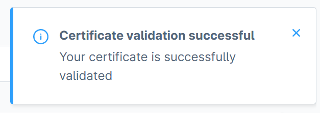

- Click the `Save` button at the top right corner.

- ` Certificate encrypted and stored` should be displayed.

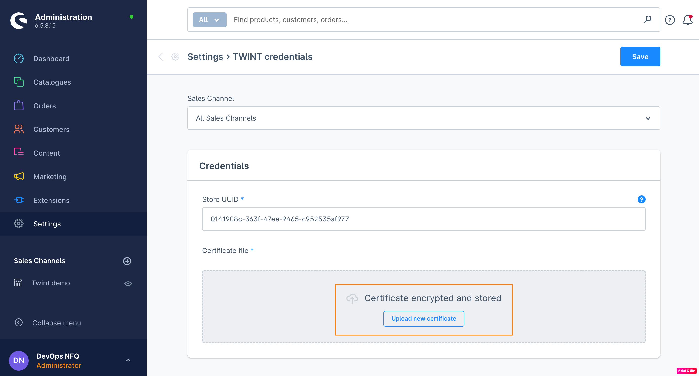

#### 3. Go to `Settings -> Extensions -> TWINT Express Checkout`

Under the `Display options` section -> Choose the placement for displaying the `TWINT Express Checkout` button.

#### 4. Go to `Settings -> Payment methods`

- Ensure that the below payment methods are enabled:
    - TWINT - Express Checkout
    - TWINT - Checkout
- The payment method can be customized (e.g. add logo) by clicking the "Edit details" link next to each payment method.

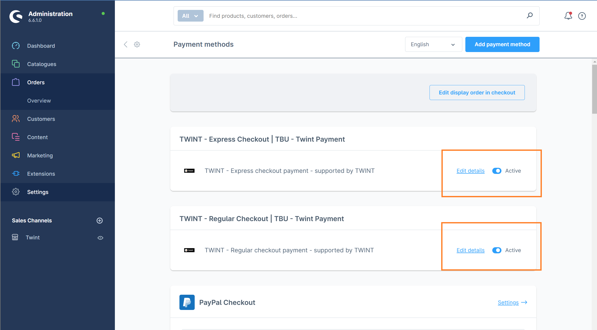

## Configure Shopware and the Sale channel

### Currency

> 🚩 **Note:**
>
> TWINT plugin supports **CHF** currency only. Please make sure CHF currency is added to the Sale channel (also known as the Storefront).
>
> If **CHF** currency was already created, please skip this section.

#### 1. Login to the Admin console panel

#### 2. Go to `Settings -> Currencies`

- Click `Add currency` button
- Enter the currency information as desired. For example:
    - **Name:** Swiss francs
    - **ISO code:** CHF
    - **Short name:** *anything*
    - **Symbol:** Fr
    - **Conversion factor:**
        - If CHF is the only currency enabled for the shop: Enter `1`
        - If the shop supports multiple currencies:
            - CHF is the first currency: Enter `1`
            - CHF is not the first currency: Enter the `Conversion factor` against the first currency *i.e.* `1.1` for `CHF = 1st currency * 1.1`
- Configure the `Price rounding` section. To display decimal places in the Sale channel, input the number of decimal places to be displayed to the `Decimals` field.
- Click the `Save` button.

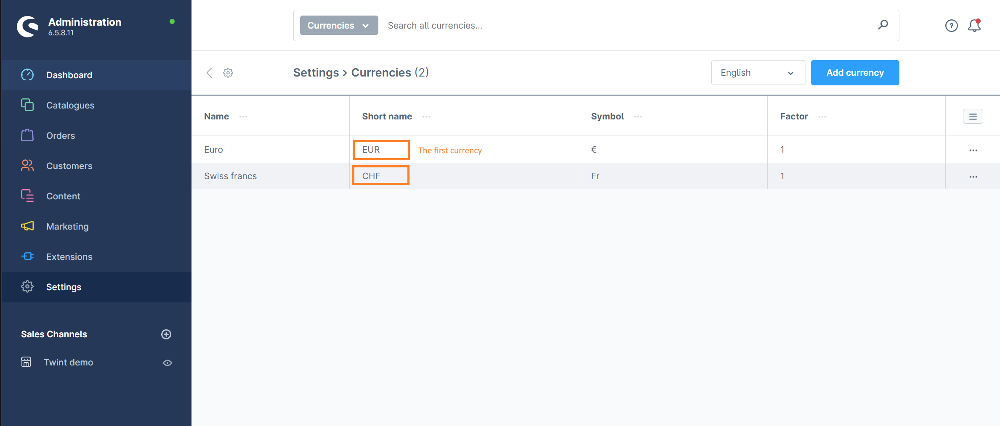

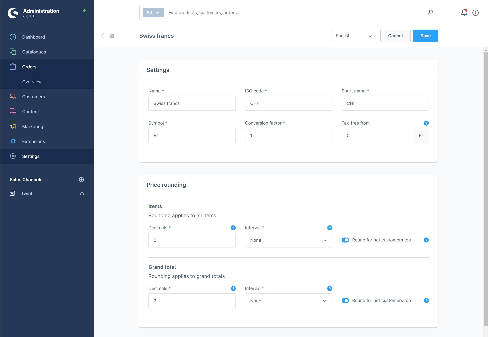

### Sale channel

> 🚩 **Note:**
>
> At this stage, the Sale channel should be set up and configured. The information below serves as kind reminder.  
> Below are some information that need our attention on.

- Ensure TWINT payment methods are added to the desired sale channel.:
    - TWINT - Express Checkout
    - TWINT - Checkout
- Ensure CHF currency is added to your sale channel.

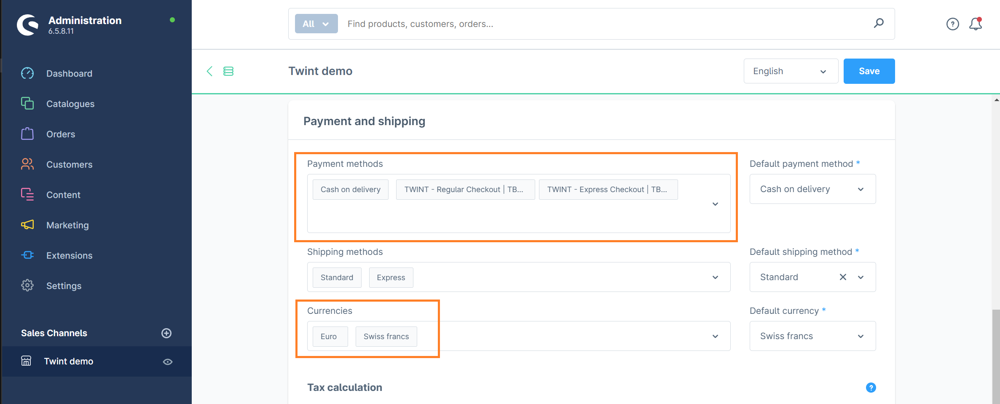

- Ensure `Switzerland` is added to `Countries`

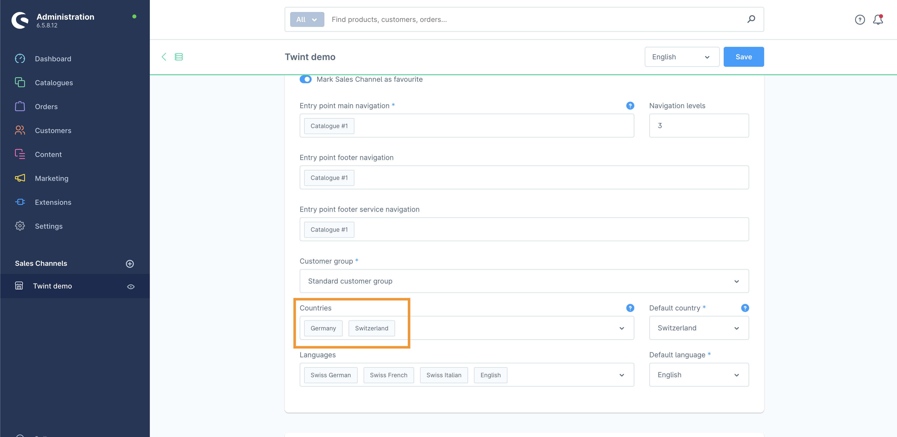
