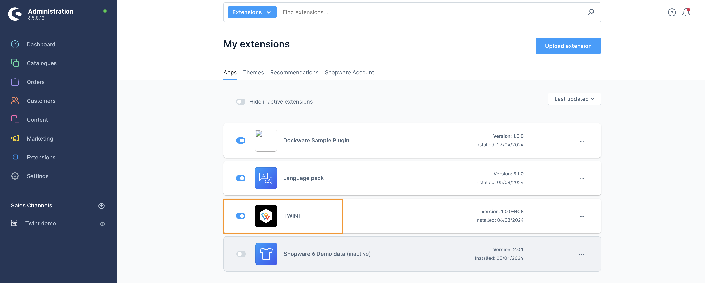
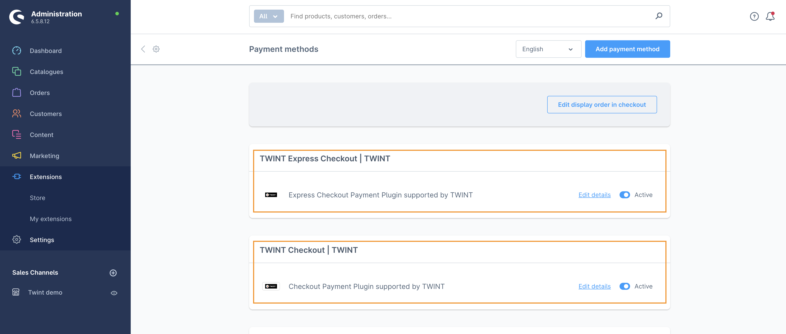

<b>TWINT Payment Extension Guideline</b>

## Installation

### 1. Download the extension

Download the plugin zip file from out git repo

Or download form the Shopware Extensions Store. 

### 2. Upload the extension

- Go to `Extensions -> My extensions`.
- Click the `Upload extension`.

- If the warning popup displayed, click `Confirm` to acknowledge.

### 3 Install the extension

After the extension was imported -> Click the `Install` link to install the extention

## Enable the extension

#### 1. Login to the Admin console panel

#### 2. Go to `Extensions -> My extensions`

Under the `Apps` tab -> Ensure that `TWINT Payment` is enabled

## Configure the extension

### Enter the Credential

#### 1. Login to the Admin console panel

#### 2. Go to `Settings -> Extensions -> TWINT Credentials`

- Enter the `Merchant ID`.
- Under the `Certificate File` click `Choose file` and browse to the `*.p12` certificate file.
- Enter the `Certificate Password`.
- **For test environment:** please turn on the `Switch to test mode` switch or else leave it off.

> 🚩 **Note:**
> 
> After entering the certification password, please wait for the flash message saying `Certificate validation successful` before clicking Save. 

- Click the `Save` button at the top right corner.

#### 3. Go to `Settings -> Extensions -> TWINT Express Checkout`

Under the `Display options` section -> Choose the placement for displaying the `TWINT Express Checkout` button.

#### 4. Go to `Settings -> Payment methods`

- Ensure that the below payment methods are enabled:
    - TWINT 
    - TWINT Express Checkout
- The payment method can be customized (e.g. add logo) by clicking the "Edit details" link next to each payment method.

## Configure Shopware and the Sale channel

### Currency

> 🚩 **Note:**
>
> TWINT payment extension supports **CHF** currency only. Please make sure CHF currency is added to the Sale channel (also know as the Storefront).
>
> If **CHF** currency was already created, please skip this section.

#### 1. Login to the Admin console panel

#### 2. Go to `Settings -> Currencies`

- Click `Add currency` button
- Enter the currency information as desired. For example:
    - **Name:** Swiss francs
    - **ISO code:** CHF
    - **Short name:** *anything*
    - **Symbol:** Fr
    - **Conversion factor:**
        - If CHF is the only currency enabled for the shop: Enter `1`
        - If the shop supports multiple currencies:
            - CHF is the first currency: Enter `1`
            - CHF is not the first currency: Enter the `Conversion factor` against the first currency *i.e.* `1.1` for `CHF = 1st currency * 1.1`
- Configure the `Price rounding` section. To display decimal places in the Sale channel, input the number of decimal places to be displayed to the `Decimals` field.
- Click the `Save` button.

### Sale channel

> 🚩 **Note:**
>
> At this stage, the Sale channel should be set up and configured. The information below serves as kind reminder.  
> Below are some information that need our attention on.

- Ensure CHF currency is added to the desired sale channel.:
    - TWINT - Express Checkout
    - TWINT - Regular Checkout
- Ensure CHF currency is added to your sale channel.

- Ensure `Switzerland` is added to `Countries`

