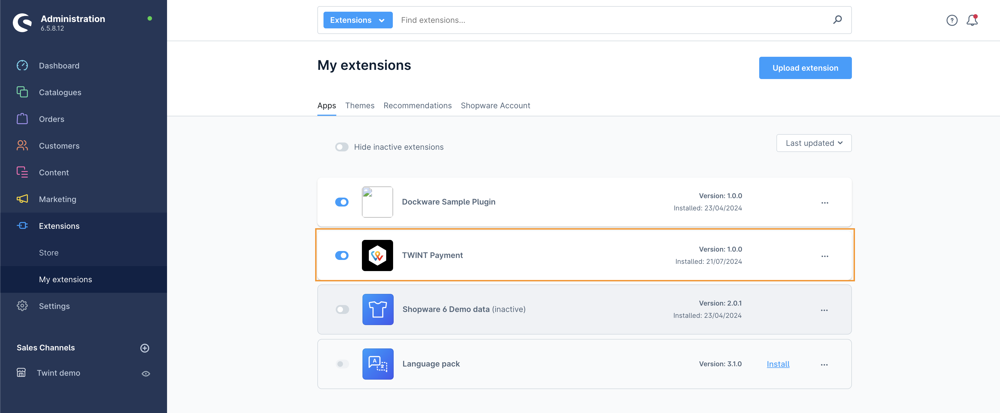

<p align="center" style="font-size:150%"><b>TWINT Payment Extension Guideline</b></p>

## Installation

```
🔔 To do - Waiting for anh Truong
```

## Enable the extension

#### 1. Login to the Admin console panel

#### 2. Go to `Extensions -> My extensions`

Under the `Apps` tab -> Ensure that `TBU - Twint Payment` is enabled



## Configure the extension

### Enter the Credential

#### 1. Login to the Admin console panel

#### 2. Go to `Settings -> Extensions -> TWINT Credentials`

- Enter the `Merchant ID`.
- Under the `Certificate File` click `Choose file` and browse to the `*.p12` certificate file.
- Enter the `Certificate Password`.
- **For test environment:** please turn on the `Switch to test mode` switch or else leave it off.

> 🚩 **Note:**
> 
> After enter the certification password, please wait for the flash message saying `Certificate validation successful` before click Save. 


- Click the `Save` button at the top right corner.


#### 3. Go to `Settings -> Extensions -> TWINT Express Checkout`

Under the `Display options` section -> Select where you want the `Twint Express Checkout` button to be displayed.

```
🔔 To do - "Checkout options" section | Waiting for the update wording
```

#### 4. Go to `Settings -> Payment methods`

- Ensure that the below payment methods are enabled:
    - TWINT - Express Checkout | TBU - Twint Payment
    - TWINT - Regular Checkout | TBU - Twint Payment
- You can further custom the payment method (e.g. add logo) by click the `Edit details` link next to each payment method.


## Configure Shopware and the Sale channel

### Currency

> 🚩 **Note:**
>
> TWINT payment extension requires the Currency to be **CHF** so we need to make sure **CHF** currency is available for the front store (as know as the Sale channel).
>
> If you already have **CHF** currency created please ignore this section.

#### 1. Login to the Admin console panel

#### 2. Go to `Settings -> Currencies`

- Click `Add currency` button
- Enter the currency information as desired. For example:
    - **Name:** Swiss francs
    - **ISO code:** CHF
    - **Short name:** *anything*
    - **Symbol:** Fr
    - **Conversion factor:**
        - If CHF is the only currency: Enter `1`
        - If your shop support multiple currency:
            - CHF is the first one: Enter `1`
            - CHF is not the first currency: Enter the conversion rate against the first currency *i.e.* `1.1` for `CHF = 1st currency * 1.1`
- Make change to the `Price rounding` section, especially the `Decimals` field for the displayed decimal places in the front store.
- Click the `Save` button.


### Sale channel

> 🚩 **Note:**
>
> This is more about Shopware administration so we assume you should have your Sale channel created and configured.  
> Below are just some information need you attention on.

- You can have as many payment methods as you want, but please ensure the below payment methods are added to your sale channel:
    - TWINT - Express Checkout | TBU - Twint Payment
    - TWINT - Regular Checkout | TBU - Twint Payment
- Ensure CHF currency is added to your sale channel.